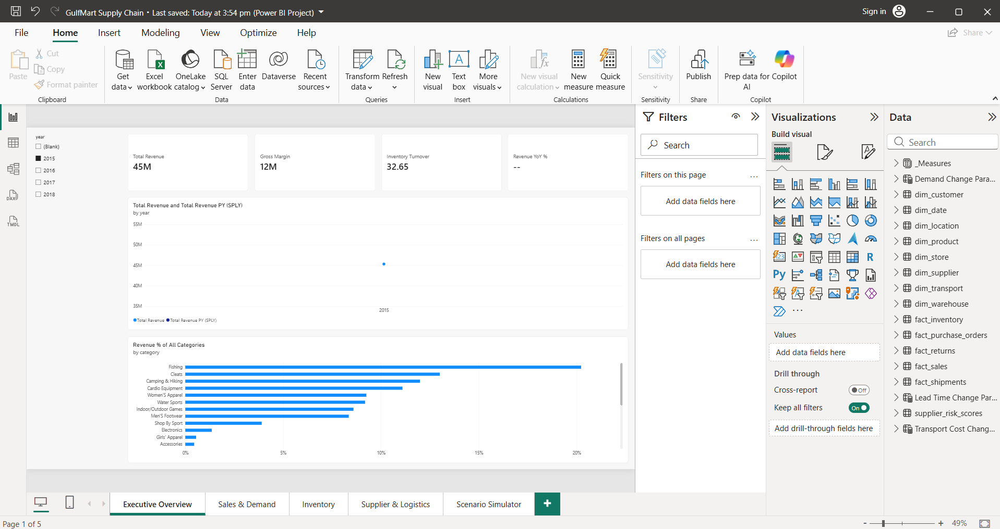
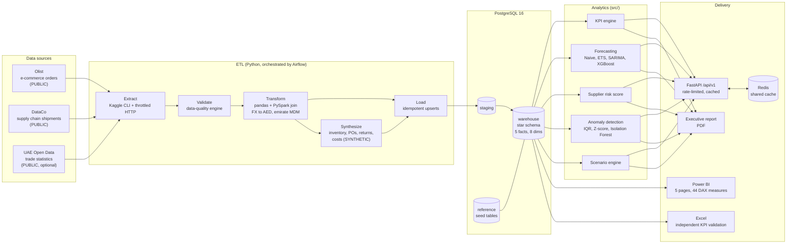

# GulfMart Supply Chain Intelligence & Risk Analytics Platform

[](https://github.com/Dewwbe/Supply-Chain-Intelligence-Risk-Analytics-Platform/actions/workflows/ci.yml)


An end-to-end data engineering and decision-intelligence platform for
**GulfMart Retail Group**, a simulated UAE retailer operating across Dubai,
Abu Dhabi, Sharjah, Ajman and Ras Al Khaimah. Raw multi-source data flows
through ETL into a PostgreSQL star schema, and then into SQL analytics,
forecasting, supplier risk scoring, anomaly detection and a what-if scenario
engine. Results are served through a versioned REST API, a Power BI report,
Excel cross-checks and an executive report.


<sub>The Power BI **Executive Overview** page (filtered to 2015): headline KPIs, revenue against the same period last year, and category revenue share. Four more pages cover Sales & Demand, Inventory, Supplier & Logistics, and a Scenario Simulator with What-If sliders.</sub>

---

## Contents

- [Purpose](#purpose)
- [System diagram](#system-diagram)
- [Architecture](#architecture)
- [Datasets and why they were chosen](#datasets-and-why-they-were-chosen)
- [Tools and technologies](#tools-and-technologies)
- [REST API](#rest-api)
- [Download and run](#download-and-run)
- [Testing, quality and CI](#testing-quality-and-ci)
- [Key findings](#key-findings)
- [Repository layout](#repository-layout)
- [Documentation](#documentation)

## Purpose

GulfMart's management had no single, governed view across sales, inventory,
suppliers and logistics. Decisions were made from disconnected exports. The
platform answers seven business questions with evidence
([`docs/business_requirements.md`](docs/business_requirements.md)):

| # | Question | Answered by |
|---|---|---|
| 1 | What products and regions drive revenue? | SQL analytics, sales EDA, `/api/v1/kpis` |
| 2 | Where are we stocking out, and where is excess inventory? | Inventory KPIs, `/api/v1/inventory` |
| 3 | Which suppliers create operational risk? | Weighted risk score, `/api/v1/suppliers/risk` |
| 4 | Can we forecast demand? | 4-model comparison, `/api/v1/forecast` |
| 5 | Which transactions or movements need investigation? | 3-method anomaly detection, `/api/v1/anomalies` |
| 6 | What if demand, lead time or transport cost change? | Calibrated scenario engine, `/api/v1/scenario/simulate` |
| 7 | Which decisions improve service while controlling cost? | [Executive report](reports/executive_report/executive_report.pdf), with evidence-backed recommendations |

The project is built as a real engagement, not a notebook exercise. Every
KPI is defined once ([`docs/kpi_dictionary.md`](docs/kpi_dictionary.md)) and
computed identically in SQL, Python, DAX and Excel. Every data field is
labelled **PUBLIC**, **SYNTHETIC** or **DERIVED**
([`docs/data_dictionary.md`](docs/data_dictionary.md)). Every recommendation
cites the metric or statistical test behind it.

## System diagram



**Runtime (Docker Compose):** `postgres` (the warehouse, with schema and
seeds applied on first start), `redis` (the cache shared by API workers) and
`api` (FastAPI and uvicorn, running as non-root with a health check). The ETL
runs on the host or under Airflow and writes into `postgres`.

## Architecture

**Layers.** Data moves `raw files → staging → warehouse → analytics →
delivery`. Each layer has one job:

- **Staging** mirrors the sources after light cleaning (full refresh).
- **Warehouse** is a Kimball star schema. The facts are `fact_sales`,
  `fact_shipments`, `fact_inventory`, `fact_purchase_orders` and
  `fact_returns`. The dimensions are date, product, customer, location,
  store, supplier, transport and warehouse. Loads are idempotent `INSERT …
  ON CONFLICT` upserts on natural keys, so a re-run never duplicates rows.
- **Analytics** modules in `src/` read the warehouse through one shared
  SQLAlchemy engine. 39 SQL queries under `sql/` (window functions, CTEs,
  `FILTER`) are the reference implementations the Python, DAX and Excel
  versions are cross-checked against.
- **Delivery** consists of a versioned API, the Power BI project (TMDL
  semantic model and PBIR report, stored as reviewable text), Excel
  workbooks and the executive report.

**Design decisions worth knowing:**

- **Synthetic data is deterministic.** Every simulated value is a hash of a
  real key, never `random`, so re-running the pipeline reproduces the
  same data. Real demand drives the inventory simulator. Only
  stock bookkeeping is simulated.
- **One definition per KPI.** `src/kpi/summary.py` is the ground truth.
  SQL, DAX and Excel are tested against it. A consistency test caught a
  Fill Rate formula defect during Phase 11: the old formula reported 51.1%,
  the corrected one 90.2%.
- **Tech only where it solves a problem.** PySpark is used once, for the
  multi-table Olist join. Airflow schedules the daily pipeline. Hadoop is
  deliberately absent, because nothing at this data volume needs a
  distributed filesystem.

**Rate limiting, caching and throttling** are each applied only where they
solve a real problem:

| Control | Applied to | Why | Not applied to |
|---|---|---|---|
| **Caching** (in-process, or Redis in Docker) | KPIs, supplier risk, inventory, forecasts, anomalies, and the scenario *baseline* | They recompute from a warehouse that changes once a day but is read far more often. The first KPI call takes about 5 s; cached calls take about 10 ms. | Scenario *results*, which are different for every input |
| **Rate limiting**, default tier (60/min per IP) | Cached reads and the scenario calculator | Protects the warehouse from bursts | `/health`, `/health/ready`, `/docs`: an uptime probe must never get a 429 |
| **Rate limiting**, expensive tier (10/min) | Forecasts and anomalies | Each new parameter combination is a cache miss that fits a model or scans the full history, so the cache alone can't protect them | — |
| **Outbound throttling** (token bucket) | ETL pulls from the UAE Open Data portal | Respects the portal's fair-use limits | Local file reads |

If Redis goes down, the API recomputes rather than failing. The cache is an
optimisation, not a dependency.

## Datasets and why they were chosen

No public dataset represents a UAE retailer end to end. This is disclosed
rather than hidden. The project combines public datasets that each supply a
signal the others lack, and simulates only what no public source records:

| Dataset | Label | Size | Why it was chosen |
|---|---|---|---|
| [Olist Brazilian E-Commerce](https://www.kaggle.com/datasets/olistbr/brazilian-ecommerce) | PUBLIC | 99,441 orders, 112,650 order lines | Real multi-table retail transactions (orders → items → products → customers) with purchase and delivery timestamps. It exercises genuine star-schema design and joins. |
| [DataCo Smart Supply Chain](https://www.kaggle.com/datasets/shashwatwork/dataco-smart-supply-chain-for-big-data-analysis) | PUBLIC | 180,519 order lines | The only large public source with **scheduled vs actual shipping days**, delivery status, shipping mode and product departments. That provides real lead-time and on-time-delivery signal for supplier and logistics analytics. |
| UAE Open Data: foreign trade | PUBLIC (optional) | 21,593 rows | UAE-specific macro context. Profiled and staged; nothing downstream depends on it. |
| Inventory, purchase orders, returns, warehouses, stores, carriers, unit costs | SYNTHETIC | ~220k rows | No public dataset records stock levels, POs or returns. Each is generated from real-data distributions (for example, inventory is driven by real daily demand) and labelled SYNTHETIC wherever it appears. |
| KPIs, risk scores, forecasts, anomalies, scenarios | DERIVED | — | Computed from the above |

Source geography is relabelled into the five emirates, and DataCo
departments are treated as suppliers, both for narrative context. The
executive report therefore makes no regional or supplier-identity claims.
The planned M5 and UAE CPI sources were not loaded.

## Tools and technologies

| Area | Technology | Purpose in this project |
|---|---|---|
| Storage | **PostgreSQL 16** | Staging, star-schema warehouse and reference data; window functions and CTEs for analytics SQL |
| ETL | **Python, pandas** | Extraction, cleaning, currency standardisation to AED, master data, synthesis, loading |
| ETL | **PySpark** | The one large multi-table join (Olist orders × items × products × customers) |
| Orchestration | **Apache Airflow** | Daily DAG: extract → validate → transform → load → quality report (`python -m etl.run_local` runs the same steps without Airflow) |
| Data access | **SQLAlchemy, psycopg 3** | One shared connection pool for the ETL, analytics and API |
| Acquisition | **Kaggle CLI, httpx** | Dataset downloads; throttled HTTP client for the UAE portal |
| Statistics | **SciPy** | Mann-Whitney, Kruskal-Wallis and normality tests; normal distribution for the scenario model |
| Forecasting | **statsmodels, XGBoost** | Seasonal Naive, ETS, SARIMA and quantile XGBoost, all with 80% prediction intervals |
| Anomaly detection | **scikit-learn** | Isolation Forest, alongside IQR and Z-score |
| API | **FastAPI, Pydantic** | Versioned REST API with validated request and response models, plus OpenAPI docs |
| API | **uvicorn** | ASGI server |
| API | **slowapi** | Per-route rate limiting |
| Caching | **Redis 7** | Cache shared across API workers, with an in-process fallback |
| Observability | **structlog** | JSON log lines (including uvicorn's), a request ID per request, no `print()` |
| Testing | **pytest, pytest-cov** | Unit and integration tests; CI fails below 80% coverage |
| Quality | **black, ruff, mypy (strict), pre-commit** | Formatting, linting (including a `print()` ban), static typing, commit hooks |
| Delivery | **Docker, Docker Compose** | Reproducible Postgres, Redis and API stack |
| CI | **GitHub Actions** | lint → type-check → test (with a real Redis) → build and smoke-test the stack, on every push and PR |
| BI | **Power BI (DAX, TMDL, PBIR)** | 5-page report and 44 measures, stored as reviewable text files |
| BI | **Excel (pywin32 COM)** | Native PivotTables and formulas that independently re-derive every KPI |
| Analysis | **Jupyter, matplotlib, seaborn** | Profiling, EDA and modelling notebooks (01–09) |
| Reporting | **Markdown, Microsoft Edge (headless)** | The executive report, rendered to PDF from a template whose numbers are recomputed on every build |

## REST API

Interactive docs are at `http://localhost:8000/docs` once running. Every
analytics route lives under `/api/v1`.

| Method | Route | Returns | Cached | Rate tier |
|---|---|---|---|---|
| GET | `/api/v1/kpis` | 10 headline KPIs (revenue, margin, AOV, inventory value, stockout, fill rate, OTD, lead time, turnover) | yes | default |
| GET | `/api/v1/suppliers/risk` | Risk score and level per supplier, with the 8 metrics behind each score | yes | default |
| GET | `/api/v1/inventory?warehouse=` | Network and per-warehouse stockout rate, fill rate, value, products out of stock | yes | default |
| GET | `/api/v1/forecast?product_id=&horizon=&model=` | Weekly demand forecast with an 80% interval (`seasonal_naive`, `ets`, `sarima`, `xgboost`) | per product/model/horizon | expensive |
| GET | `/api/v1/forecast/products` | Products with enough history to forecast | yes | default |
| GET | `/api/v1/anomalies?metric=&severity=&method=&limit=` | Flagged points across 5 domains, highest score first | per domain | expensive |
| POST | `/api/v1/scenario/simulate` | Baseline vs scenario for demand, lead time and transport cost changes | baseline only | default |
| GET | `/health` · `/health/ready` | Liveness · readiness (warehouse loaded, cache reachable) | — | never limited |

```bash
curl "http://localhost:8000/api/v1/forecast?product_id=365&horizon=4"
curl -X POST http://localhost:8000/api/v1/scenario/simulate \
     -H "Content-Type: application/json" \
     -d '{"demand_change_pct": 10, "lead_time_change_pct": 0, "transport_cost_change_pct": 0}'
```

Errors are explicit:

- **422** — invalid input.
- **404** — unknown product or warehouse.
- **429** — rate limit exceeded, with `Retry-After`.
- **503** — warehouse unreachable or not yet loaded. Internals are never
  leaked.

## Download and run

**Prerequisites:** Git, Python 3.11, Docker Desktop, Java 17 (for PySpark),
and a free [Kaggle API token](https://www.kaggle.com/settings).

```bash
git clone https://github.com/Dewwbe/Supply-Chain-Intelligence-Risk-Analytics-Platform.git
cd Supply-Chain-Intelligence-Risk-Analytics-Platform
cp .env.example .env                      # then set KAGGLE_USERNAME and KAGGLE_KEY
python -m venv .venv
source .venv/bin/activate                 # Windows: .venv\Scripts\Activate.ps1
pip install -r requirements.txt
docker compose up -d --wait postgres redis
python -m etl.extract.download_raw --all && python -m etl.run_local
docker compose up -d --build --wait api
```

Then open **http://localhost:8000/docs**. Check readiness with
`curl http://localhost:8000/health/ready`.

To see the Power BI report, run `python powerbi/export_csv_extracts.py`,
then open `powerbi/GulfMart Supply Chain.pbip` in Power BI Desktop.

[`setup.md`](setup.md) covers what each step does, optional components
(Power BI, Excel, the report, Airflow), configuration and troubleshooting.
That includes the common Windows case of a native Postgres already using
port 5432.

## Testing, quality and CI

```bash
make ci      # ruff + black --check -> mypy --strict -> pytest with the 80% coverage gate
```

- **240+ tests, ~97% line coverage on `src/`.**
  - *Unit tests* stub the warehouse and exercise the real logic: every
    endpoint's caching and rate-limit behaviour, error mapping, KPI formulas
    and cache backends (including Redis outages).
  - *Integration tests* run against the live warehouse and a real Redis.
    They check cross-endpoint consistency (for example, inventory and KPI
    routes must agree) and SQL-vs-Python KPI parity.
  - Integration tests skip automatically when their service isn't running.
- **CI** ([`.github/workflows/ci.yml`](.github/workflows/ci.yml)) runs
  `lint → type-check → test → build` on every push and pull request. The
  build job boots the full Compose stack and checks that `/health` is up and
  that an empty warehouse returns a clear 503 rather than an error.
- **Structured logging:** one JSON object per line, including uvicorn's
  logs, with a request ID per request (echoed in `X-Request-ID`). Ruff's T20
  rule blocks `print()` in `src/`, `etl/` and `airflow/`.
- **pre-commit** runs the same formatters, linters and mypy on every commit.

## Key findings

From the [executive report](reports/executive_report/executive_report.pdf).
Modelled figures come from simulated inventory data (see its limitations
section):

- **Stockouts are driven by lead time.** Products with 11–14 day
  replenishment are out of stock on 20.9% of days, against 8.2% for 3–7 day
  products (Spearman ρ = 0.84). A reorder point of *lead time + 3 days*
  cuts modelled stockouts from 13.5% to 8.4% and lifts fill rate from 90.2%
  to 97.6%, for 29% more inventory.
- **Lateness is network-wide.** On-time delivery is 42.7%, with no
  significant lead-time difference between suppliers (Kruskal-Wallis
  p = 0.139).
- **Only Back-to-school moves demand** (Mann-Whitney p = 0.011). Ramadan,
  Eid and National Day show no significant uplift.
- **Forecast calibration matters more than accuracy here.** Models are within
  about 1 WAPE point of each other, but only Seasonal Naive's 80% intervals
  cover close to 80% of actuals (77%, against 47% for XGBoost).

## Repository layout

```
├── airflow/dags/            Daily pipeline DAG
├── database/                schema/ (DDL), seed/ (reference data), docker-init.sh
├── etl/                     extract/ validate/ transform/ synthesize/ load/, run_local.py
├── sql/                     39 analysis queries (02_sales … 07_kpi)
├── src/
│   ├── api/                 FastAPI app: core/ (config, cache, errors, dependencies),
│   │                        middleware/ (rate limit, request logging), routers/
│   ├── kpi/                 KPI ground truth + inventory status
│   ├── forecasting/  supplier_risk/  anomaly_detection/  scenario_model/
│   ├── eda/  data_quality/  common/ (db, logging, throttled http, UAE calendar)
├── tests/                   unit/ and integration/ (auto-skipping)
├── notebooks/               01 profiling … 09 scenario analysis
├── powerbi/                 .pbip project (TMDL model + PBIR report), DAX source, CSV export
├── excel/                   KPI validation + scenario workbooks (built via COM)
├── reports/                 Phase outputs + executive_report/ (PDF, evidence, figures)
├── docs/                    business requirements, data & KPI dictionaries, plan, standards
├── Dockerfile  docker-compose.yml  .dockerignore
├── requirements.txt         dev (includes requirements-api.txt, used by the image)
├── requirements-airflow.txt Airflow, installed with its constraints file
├── .env.example  setup.md  Makefile  pyproject.toml  .pre-commit-config.yaml
└── .github/workflows/ci.yml
```

## Documentation

| Document | Contents |
|---|---|
| [`setup.md`](setup.md) | Full setup, configuration, troubleshooting |
| [`docs/business_requirements.md`](docs/business_requirements.md) | Stakeholders, questions, scope |
| [`docs/data_dictionary.md`](docs/data_dictionary.md) | Every table and field, with PUBLIC/SYNTHETIC/DERIVED labels |
| [`docs/kpi_dictionary.md`](docs/kpi_dictionary.md) | Every KPI's formula, grain, owner and BI page |
| [`docs/implementation_plan.md`](docs/implementation_plan.md) | The 12-week, phase-by-phase build plan |
| [`docs/coding_standards.md`](docs/coding_standards.md) | Conventions for SQL, Python and tests |
| [`reports/executive_report/`](reports/executive_report/) | Executive report and the evidence behind it |
| [`powerbi/README.md`](powerbi/README.md) · [`excel/README.md`](excel/README.md) | BI layer details |
