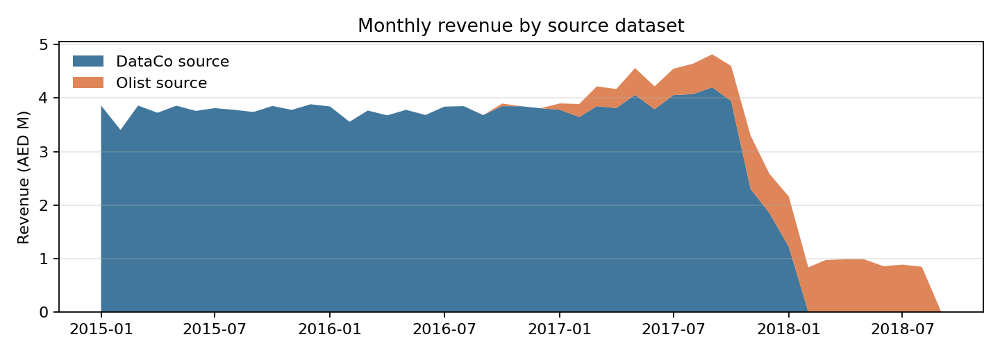
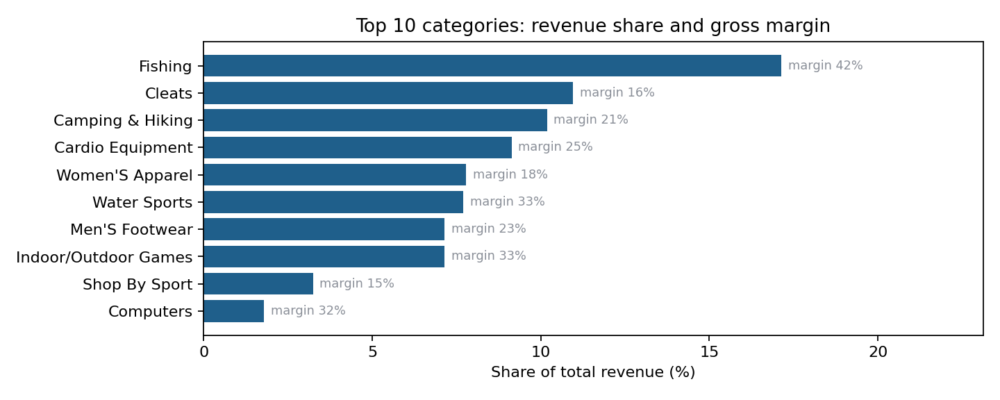
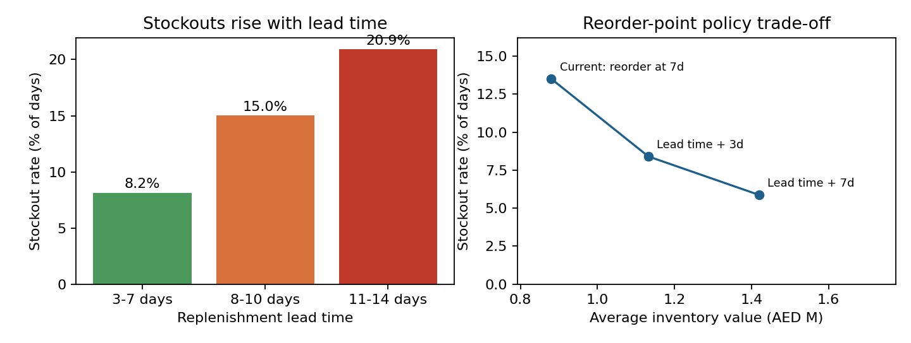
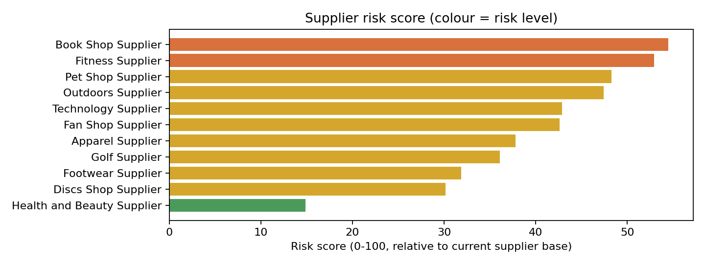
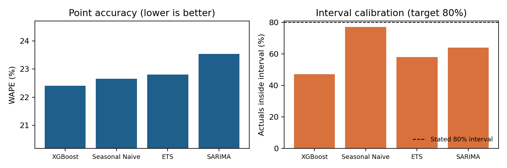
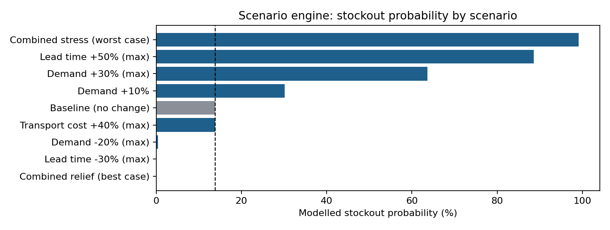

# GulfMart Supply Chain Intelligence

Executive Report: findings, risks and evidence-based recommendations

**Prepared for:** GulfMart Retail Group executive team (COO, Supply Chain, Procurement, Finance) 
**Scope:** sales, inventory, suppliers and logistics, {{date_min}} to {{date_max}} 
**Basis:** the GulfMart Supply Chain Intelligence Platform (Phases 1–10)

> **Read this first.** GulfMart is a simulated client. Transactions come from public
> datasets (Olist, DataCo) relabelled into a UAE context. Inventory, purchase-order,
> return and cost data are **simulated** from distributions of the real data. Every
> figure below is labelled as observed (public data), modelled (simulated) or derived.
> Recommendations describe what the evidence supports *within this model*. They
> are not claims about a real retailer.

## 1. Executive summary

GulfMart's network generated **{{total_revenue}}** in revenue from **{{total_units}}** units
over the analysis period, at a gross margin of **{{gross_margin}}** ({{gross_margin_pct}}).
The platform now gives management one governed view of sales, inventory, suppliers and
logistics, and the evidence points to one dominant operational problem: **replenishment
does not account for lead time, so availability fails where supply is slowest.**

| Headline KPI | Value | What it says |
|---|---|---|
| Stockout rate (modelled) | {{stockout_rate}} of product-days | Roughly one day in seven, a tracked product is out of stock |
| Fill rate (modelled) | {{fill_rate}} | {{units_lost}} of {{units_demanded}} units demanded could not be served |
| Supplier on-time delivery (observed) | {{supplier_otd}} | Fewer than half of shipments arrive by the promised date |
| Average lead time (observed) | {{avg_lead_time}} days | Short, but unreliable: the lateness is systemic, not supplier-specific |
| Inventory value, latest (modelled) | {{inventory_value}} | Capital currently held in the top-{{n_products_inv}} tracked products |
| Inventory turnover (modelled) | {{inventory_turnover}}× | Lean stock: little buffer against disruption |

**Key findings**

1. **Stockouts are driven by lead time.** Products with 11–14 day replenishment lead
   times are out of stock on {{band_long}} of days, against {{band_short}} for 3–7 day
   products (Spearman ρ = {{rho}} across {{n_products_inv}} products).
2. **Lead time is the biggest risk lever; transport cost is not.** In the scenario engine,
   a 50% lead-time increase lifts stockout probability from {{sc_base_stockout}} to
   {{sc_lt50_stockout}}. A 40% transport-cost increase changes cost but not availability.
3. **Late delivery is network-wide.** On-time delivery is {{supplier_otd}}, and lead
   times do not differ significantly between suppliers (Kruskal-Wallis p = 0.139).
   Switching suppliers would not fix it.
4. **Only one seasonal window moves demand.** Back-to-school raises daily revenue
   significantly (p = 0.011). Ramadan, Eid, National Day, Summer and Year-end do not
   (all p > 0.4).

**Top recommendations** (evidence and trade-offs in §10)

| # | Recommendation | Expected effect (modelled) |
|---|---|---|
| R1 | Set reorder points at *lead time + 3 days* of demand instead of a flat 7 days | Stockout {{cur_stockout}} → {{lt3_stockout}}; fill {{cur_fill}} → {{lt3_fill}}; +{{lt3_units_delta}} units served; inventory +{{lt3_inv_delta}} |
| R2 | Invest in lead-time reliability before transport-cost savings | Lead time −30% cuts stockout probability to {{sc_lt30_stockout}} |
| R3 | Pre-build stock for Back-to-school only, not for Ramadan/Eid/National Day | Targets the only statistically significant seasonal uplift |
| R4 | Plan safety stock on Seasonal Naive intervals, not XGBoost's | Seasonal Naive intervals capture {{fc_naive_cov}} of actuals vs {{fc_best_cov}} |
| R5 | Put the {{n_high_risk}} High-risk suppliers on corrective review, targeting cancellations and cost volatility | Addresses the specific drivers of their scores |

## 2. Business problem

GulfMart operates across Dubai, Abu Dhabi, Sharjah, Ajman and Ras Al Khaimah. Before this
platform, decisions were made from disconnected exports, and no one could answer basic
cross-functional questions with evidence. The engagement set out seven questions
(`docs/business_requirements.md` §2):

| # | Question | Answered in |
|---|---|---|
| 1 | What products and regions are driving revenue? | §5 Sales findings |
| 2 | Where are we experiencing stockouts and excess inventory? | §6 Inventory findings |
| 3 | Which suppliers are creating operational risk? | §7 Supplier & logistics findings |
| 4 | Can we forecast future demand? | §8 Forecasting |
| 5 | What unusual transactions or inventory movements need investigation? | §9 Anomaly detection |
| 6 | What happens if demand, lead time or transport cost change? | §9 Scenario analysis |
| 7 | Which decisions improve service levels while controlling cost? | §10 Recommendations |

Each stakeholder has a primary Power BI page. The COO and Finance use **Executive
Overview** and **Scenario Simulator**. The Supply Chain Manager uses **Inventory**, and
Procurement uses **Supplier & Logistics**. Every KPI in this report is defined once, in
`docs/kpi_dictionary.md`, and computed identically in SQL, Python, DAX and Excel.

## 3. Data architecture

**Sources.** Two public transactional datasets carry the observed data: Olist (Brazilian
e-commerce; 99,441 orders, 112,650 order lines) and DataCo (global supply chain; 180,519
order lines with shipping dates and delivery status). UAE Open Data trade statistics
(21,593 rows) were profiled and staged for context. Planned M5 and UAE CPI sources were
not loaded, and nothing in this report depends on them. The two transactional sources
cover different periods: DataCo runs to {{dataco_last}} and Olist starts in
{{olist_first}} (Figure 1).

**Pipeline.** A Python ETL (`etl/`) extracts, validates, standardises currency to AED,
relabels source geography into the five emirates, and loads PostgreSQL through
`staging` into a `warehouse` star schema. That schema has **5 fact tables** (sales
{{sales_rows}} rows, shipments {{shipment_rows}}, inventory {{inventory_rows}},
purchase orders, returns) and **8 dimensions** (date, product, customer, location,
store, supplier, transport, warehouse). Simulated tables are generated deterministically
(`etl/synthesize/`), so every run reproduces the same data. An Airflow DAG orchestrates
the pipeline.

**Analytics and delivery.** On top of the warehouse sit 39 SQL analysis queries, Python
modules for EDA, forecasting, supplier risk, anomaly detection and scenario modelling, a
FastAPI service (`/api/v1/kpis`, `/api/v1/scenario/simulate`), a Power BI project (5
pages, 44 DAX measures), and two Excel workbooks. The workbooks independently recompute
the headline KPIs and replay the scenario engine. The API and the Excel cross-check run
off the same ground-truth module (`src/kpi/summary.py`).

| Label | Meaning | Examples in this report |
|---|---|---|
| **Observed** (PUBLIC) | Real public data, cleaned but not fabricated | Revenue, units, lead times, on-time delivery |
| **Modelled** (SYNTHETIC) | Simulated from real-data distributions | Stock levels, stockouts, fill rate, unit cost, POs, returns |
| **Derived** | Computed from the above | KPIs, risk scores, forecasts, anomalies, scenarios |

## 4. Data quality

The unified sales dataset ({{dq_rows}} rows) passed validation with **no critical
issues**. There is {{dq_missing}} overall missingness, concentrated in optional
descriptive fields, and {{dq_warnings}} outlier warnings on line-item sales value
(IQR and |z| > 3). Those outliers are genuine high-value orders, so they were kept
rather than removed. Profiling the raw sources found zero duplicate rows. The UAE trade
file's 19.6% missingness comes entirely from three always-empty metadata columns.

**A KPI defect was found and fixed during this phase.** The original Fill Rate formula
estimated unmet demand from stock movements (`opening − closing − received`). That
expression reduces to `sold − 2 × received`, which pushes the result toward 50%
regardless of actual service. The platform reported **51.1%**. The Excel cross-check
had "matched" it only because it reused the same formula. The corrected definition
divides units fulfilled by units actually demanded (real daily sales for the same
product and day), giving **{{fill_rate}}**. It is now implemented identically in SQL,
Python, DAX and Excel, with a regression test comparing Python against the reference
SQL. *Lesson: a cross-check only validates a KPI when it re-derives the value from the
written definition, not from another implementation.*

## 5. Sales findings

Figure 1. Monthly revenue (observed), stacked by source dataset. The step
changes are source coverage, not market movements.

**Growth cannot be read from this history.** Revenue was {{rev_2016}} in 2016 and
{{rev_2017}} in 2017 ({{rev_2017_growth}}). However, Figure 1 shows the total is two
datasets with different coverage windows: Olist ramps up from {{olist_first}} and
DataCo ends in {{dataco_last}}. The year-on-year change mostly reflects which source
was active, so this report makes **no growth claim**. The Power BI *Revenue YoY %*
measure should be read with the same caveat.

Figure 2. Revenue share (observed) and gross margin (modelled unit
cost) for the ten largest of {{n_categories}} categories.

**Revenue is concentrated.** The top three categories generate {{top3_share}} of
revenue, led by {{top_cat}} ({{top_cat_share}}). Margin differences between categories
({{top_cat}} {{top_cat_margin}}, {{cat2}} {{cat2_margin}}, {{cat3}} {{cat3_margin}}) come
from **simulated** unit costs, drawn at a per-category margin rate between 15% and 45%.
They illustrate the reporting capability but **are not used as evidence** for any
recommendation.

**Regional split is not evidence either.** Abu Dhabi shows 61% of revenue, but source
locations are hashed into emirates with fixed weights (`etl/transform/master_data.py`).
The regional mix reflects that assignment, not UAE demand.

**Seasonality was tested, not assumed.** Daily revenue in each UAE seasonal window was
compared with all other days (Mann-Whitney U, α = 0.05):

| Window | Days | p-value | Effect (rank-biserial r) | Result |
|---|---|---|---|---|
| Back-to-school | 112 | **0.011** | 0.14, higher | **Significant uplift** |
| National Day | 9 | 0.42 | 0.15, lower | Not significant |
| Ramadan | 118 | 0.49 | 0.04, lower | Not significant |
| Summer | 412 | 0.52 | 0.02, lower | Not significant |
| Year-end | 51 | 0.74 | 0.03, higher | Not significant |
| Eid | 24 | 0.75 | 0.04, lower | Not significant |

Back-to-school averages AED 119.2k of revenue per day against AED 113.3k on regular days
(+5.2%). The null results for Ramadan and Eid are valid findings in their own right:
this demand history does not support holiday-specific stock builds. Discounting has no
meaningful relationship with order value (Spearman r = −0.015). With this many rows,
that coefficient is statistically non-zero but commercially negligible.

## 6. Inventory findings

Inventory is modelled for the {{n_products_inv}} highest-volume products. Daily demand
is the real sales history, while stock levels come from a simulated (s, S) reorder
policy: reorder when stock falls to 7 days of average demand, then order up to 30 days.
Each product has a replenishment lead time of 3–14 days.

Figure 3. Left: stockout rate by replenishment lead time. Right: the same
simulator re-run under three reorder policies (evidence/reorder_policy_simulation.csv).

**The stockout problem is structural.** A flat 7-day reorder point cannot cover a lead
time longer than 7 days, so every product with slower supply runs dry before its
replenishment lands:

| Lead-time band | Products | Stockout rate |
|---|---|---|
| 3–7 days | {{band_short_n}} | {{band_short}} |
| 8–10 days | {{band_mid_n}} | {{band_mid}} |
| 11–14 days | {{band_long_n}} | {{band_long}} |

The rank correlation between lead time and stockout rate is **ρ = {{rho}}**. Network-wide,
{{stockout_rate}} of product-days end at zero stock, and {{units_lost}} demanded units
went unserved (fill rate {{fill_rate}}). Excess stock is the smaller issue: 13 of 502
products hold more than 45 days of supply. Warehouse stockout rates range narrowly
(10%–16%), which points to a policy cause rather than a site cause.

## 7. Supplier and logistics findings

Figure 4. Supplier risk score (derived): a weighted, min-max-normalised
index of late delivery 25%, defect rate 20%, lead-time variability 15%, cost volatility
15%, cancellations 15% and average lead time 10%.

**Delivery performance is weak everywhere.** Only {{supplier_otd}} of shipments arrive by
the expected date (observed). Supplier on-time rates cluster between 38.6% and 43.3%.
A Kruskal-Wallis test finds **no significant difference in lead time between the 11
suppliers** (H = 14.8, p = 0.139, ε² ≈ 0). The lateness is a property of the network
(shipping modes and carriers), not of particular suppliers.

**Risk scores separate suppliers on the simulated dimensions.** {{risk_top}}
({{risk_top_score}}) and {{risk_second}} ({{risk_second_score}}) are rated **High**.
{{risk_low}} is the only Low-risk supplier ({{risk_low_score}}). Their delivery metrics
are near-identical to the rest, so the scores are driven by the procurement side:

| Supplier | Cancellation rate | Cost variability (CV) | Defect proxy | Purchase orders |
|---|---|---|---|---|
| Book Shop Supplier | **12.5%** (vs ~5% typical) | 0.00 | 2.2% | 16 |
| Fitness Supplier | 4.8% | **1.30** | 2.2% | 249 |
| Health and Beauty Supplier | 0.0% | 0.00 | 0.3% | 15 |

Book Shop's score rests on only 16 purchase orders, so it should be confirmed with more
history before any contractual action. Scores are *relative* to the current supplier
base (min-max normalised), so "High" means worst-in-group, not an absolute threshold.
No machine-learning benchmark was trained: no independently observed supplier-failure
outcome exists, and a label built from the scoring inputs would be circular.

**Logistics cost follows mode.** Standard Class carries 60% of shipments at AED 51
average cost; Same Day costs AED 165 per shipment. Transport cost (modelled from
distance × rate) is consistent across emirates (AED 74–75 per shipment).

## 8. Demand forecasting

Four models were compared on weekly demand for the 8 highest-volume products with at
least 100 weeks of history. The split is strictly time-based, and every model produces
an 80% prediction interval.

Figure 5. Mean WAPE and 80%-interval coverage across the 8 products
(notebooks/06_demand_forecasting.ipynb §4).

**No model is materially more accurate.** WAPE ranges from {{fc_best_wape}}
({{fc_best}}) to {{fc_worst_wape}}, a spread of about one percentage point, and
{{fc_best}}'s lead over Seasonal Naive ({{fc_naive_wape}}) is 0.24 points. **Calibration
differs sharply**, and it matters more for stock planning. Seasonal Naive's intervals
contain {{fc_naive_cov}} of actual weeks, close to the stated 80%. {{fc_best}}'s
contain only {{fc_best_cov}}, and ETS ({{fc_ets_cov}}) and SARIMA ({{fc_sarima_cov}}) are
also overconfident. Safety stock sized on an interval that is too narrow under-buffers
exactly when demand surprises. MAPE (over 250% for all models) is distorted by
near-zero weeks, so WAPE is the accuracy measure used here. SARIMA and ETS logged
convergence warnings with roughly 2.6 annual cycles of history, which is expected at
this data volume.

## 9. Anomaly detection and scenario analysis

### Anomaly detection

Three methods (IQR, Z-score, Isolation Forest) were run across five domains. They flagged
72,698 points in total, of which **{{anomaly_high}} are High severity**: {{anomaly_transport}}
transport-cost, {{anomaly_inv}} inventory-change and {{anomaly_sales}} daily-sales anomalies
(`reports/anomaly_detection/anomalies.csv`). The highest-scoring cases are
inventory-change spikes at individual warehouses, 20+ times the typical daily movement
(e.g. Abu Dhabi Distribution Center, 18 Jan 2015: +1,749 units vs −52 expected). Their
size and direction are consistent with large replenishment receipts under the policy in
§6, which a reviewer should confirm before treating them as errors.

Two method behaviours matter for any production use. IQR flags about 20% of shipment
delays, because whole-day delays have a very tight core distribution. Isolation Forest
always flags a fixed share, even where threshold methods correctly find nothing (supplier
lead times span only 0–6 days). **Thresholds must be tuned per domain before these
become alerts**, or the operations team will be flooded.

### Scenario analysis

The scenario engine calibrates its safety stock so that the no-change case reproduces
the observed baseline stockout rate. All values below cover the 90-day baseline window
(`reports/scenario_analysis/scenario_comparison.csv`).

Figure 6. Modelled stockout probability by scenario; the dashed line is
the calibrated baseline.

| Scenario | Stockout probability | Revenue at risk (90 days) |
|---|---|---|
| Baseline | {{sc_base_stockout}} | {{sc_base_rar}} |
| Demand +10% | {{sc_d10_stockout}} | {{sc_d10_rar}} |
| Lead time +50% | {{sc_lt50_stockout}} | {{sc_lt50_rar}} |
| Lead time −30% | {{sc_lt30_stockout}} | near zero |
| Transport cost +40% | {{sc_base_stockout}} (unchanged) | {{sc_base_rar}}; transport cost {{sc_base_cost}} → {{sc_tc40_cost}} |
| Combined stress (+30% demand, +50% lead time, +40% cost) | {{sc_stress_stockout}} | {{sc_stress_rar}} |

The buffer is thin: a modest 10% demand increase roughly doubles stockout probability.
Lead time is the strongest lever in both directions. Transport-cost changes affect
cost only, never availability.

## 10. Recommendations

Each recommendation names the metric or test behind it. Effects are *modelled* on this
platform's data (see §11).

**R1: Make reorder points lead-time aware.** *Owner: Supply Chain Manager.*
Replace the flat 7-day reorder point with *lead time + 3 days* of average demand
(order-up-to raised correspondingly).

- *Evidence:* stockout rate rises from {{band_short}} to {{band_long}} across lead-time
  bands (ρ = {{rho}}, §6). Re-running the same simulator on the same real demand
  (`evidence/reorder_policy_simulation.csv`) gives:

| Policy | Stockout rate | Fill rate | Avg inventory value |
|---|---|---|---|
| Current: reorder at 7 days | {{cur_stockout}} | {{cur_fill}} | {{cur_inv}} |
| **Lead time + 3 days** | **{{lt3_stockout}}** | **{{lt3_fill}}** | **{{lt3_inv}}** (+{{lt3_inv_delta}}) |
| Lead time + 7 days | {{lt7_stockout}} | {{lt7_fill}} | {{lt7_inv}} (+{{lt7_inv_delta}}) |

- *Trade-off:* the +3-day policy serves {{lt3_units_delta}} more units (about
  {{lt3_rev_delta}} of revenue at list price) for {{lt3_inv_abs_delta}} more average stock.
  Going to +7 days roughly doubles the inventory increase but serves only
  {{lt7_units_delta}} further units. +3 days is the efficient point.

**R2: Prioritise lead-time reliability over transport-cost savings.** *Owner: COO,
Procurement.* Target the delivery process (carrier SLAs, mode mix, order cut-offs)
before negotiating transport rates.

- *Evidence:* lead time −30% cuts modelled stockout probability from
  {{sc_base_stockout}} to {{sc_lt30_stockout}}, while +50% raises it to
  {{sc_lt50_stockout}}. A 40% transport-cost change moves cost only
  ({{sc_base_cost}} → {{sc_tc40_cost}} per 90 days) with zero availability impact (§9).
  On-time delivery is {{supplier_otd}}, with no significant difference between suppliers
  (Kruskal-Wallis p = 0.139, §7). The fix is network-level, not a supplier switch.

**R3: Pre-build stock for Back-to-school only.** *Owner: Supply Chain Manager.*

- *Evidence:* Back-to-school is the only window with a significant uplift (p = 0.011,
  +5.2% daily revenue). Ramadan (p = 0.49), Eid (p = 0.75) and National Day (p = 0.42)
  show none (§5). Holiday-specific builds would add stock without a demonstrated demand
  response.

**R4: Size safety stock on calibrated forecast intervals.** *Owner: Demand Planning.*
Use Seasonal Naive's intervals for safety-stock sizing. Use {{fc_best}} for point
forecasts only after recalibrating its intervals.

- *Evidence:* the models' WAPE sits within about one point of each other. Seasonal
  Naive's 80% intervals cover {{fc_naive_cov}} of actuals, against {{fc_best_cov}} for
  {{fc_best}} (§8). Interval quality, not the 0.24-point accuracy gap, decides buffer
  adequacy.

**R5: Corrective review for the {{n_high_risk}} High-risk suppliers, targeted at their
actual drivers.** *Owner: Procurement.*

- *Evidence:* {{risk_top}} ({{risk_top_score}}) has a 12.5% cancellation rate against
  about 5% for peers, but on only 16 POs, so confirm with more history first.
  {{risk_second}} ({{risk_second_score}}) has cost variability of 1.30, the second highest
  (§7). Delivery metrics do not separate suppliers, so reviews should address
  cancellations and pricing stability, not delivery.

**R6: Tune anomaly thresholds per domain before alerting.** *Owner: Data team.*

- *Evidence:* IQR flags about 20% of shipment delays and Isolation Forest flags a fixed
  share regardless of dispersion (§9). A shared default would bury the {{anomaly_inv}}
  High-severity inventory anomalies worth reviewing.

## 11. Limitations

- **Simulated operations.** Stock levels, stockouts, fill rate, unit costs, purchase
  orders and returns are simulated from real-data distributions and are not validated
  against real operations. R1's effect sizes are properties of the modelled policy.
  The *direction* (reorder points must cover lead time) is general inventory theory; the
  *magnitudes* need confirming on real data.
- **Relabelled geography and suppliers.** Emirates are hashed from source locations, and
  "suppliers" are DataCo departments. Neither the regional mix nor supplier identities
  describe a real UAE business.
- **Mixed source periods.** DataCo and Olist cover different windows, so multi-year
  trends are unreliable (§5).
- **Model scale.** Forecasts use about 2.6 years of weekly history for 8 products.
  Supplier scores are relative to 11 suppliers, some with very few POs. Anomaly
  detection ran as one historical pass, not incrementally.
- **Scenario engine.** It uses a single calibrated normal approximation at network level
  over a 90-day window. It does not model product-level or warehouse-level effects.

## 12. Future improvements

1. **Validate on real data.** Connect a real inventory and purchase-order feed and re-run
   R1's policy comparison. The simulator and KPI definitions are already parameterised
   for it.
2. **Product-level reorder optimisation.** Extend R1 from a uniform "+3 days" to
   per-product service-level targets using demand variability, not just lead time.
3. **Forecast interval recalibration** (e.g. conformal prediction) so the most accurate
   point model also has trustworthy intervals.
4. **Production monitoring.** Incremental anomaly detection with per-domain thresholds,
   plus forecast drift monitoring and scheduled retraining (out of scope for this
   engagement).
5. **Supplier risk with an outcome label.** Once real supplier-caused disruptions are
   recorded, benchmark the weighted score against a supervised model.
6. **Complete the external context.** Load UAE CPI and M5 data as originally planned, to
   test price sensitivity and improve seasonal features.

Reproduce: `python reports/executive_report/build_report.py`. KPIs, figures,
lead-time and policy evidence, supplier scores, forecast metrics, anomaly counts and
scenario values are recomputed from the warehouse extract and committed phase outputs
(`reports/`). Statistical test results (Mann-Whitney, Kruskal-Wallis, Spearman on
discounts) and supplier feature values are quoted from the phase notebooks named in
each section.

